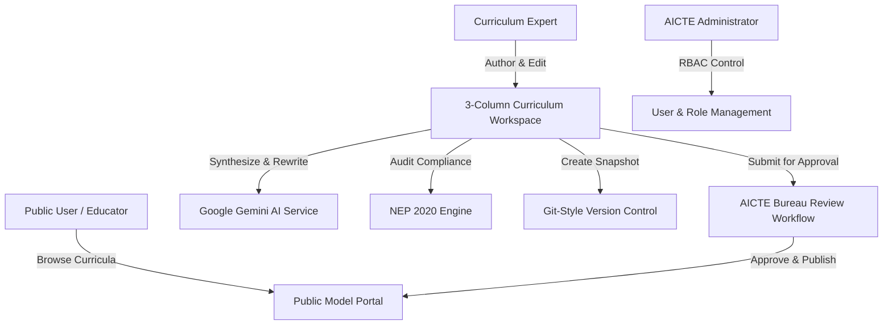

# 🎓 CurriCraft AI – Unified AICTE Model Curriculum Portal

> **Smart India Hackathon (SIH 2026) Problem Statement SIH1465 Solution**  
> **Target Organization:** All India Council for Technical Education (AICTE)  
> **Live Demo Web Application:** Powered by React, TypeScript, Tailwind CSS, Express.js, and Google Gemini Generative AI.

---
# Link 
> https://aicte-curri-craft-ai.vercel.app/
---

## 🌟 Executive Summary

**CurriCraft AI** is an AI-powered unified model curriculum platform designed for AICTE to modernize, evaluate, and publish engineering model curricula across technical universities in India. It bridges the gap between institutional curriculum design, National Education Policy (NEP 2020) guidelines, and industry skill demands using Generative AI and deterministic audit engines.

---

## ✨ Key Features & Capability Matrix

| Feature Module | Technical Implementation & Capability |
| :--- | :--- |
| ** 1. NEP 2020 Compliance Engine** | Deterministic rule-based audit scoring (0–100%) evaluating total credit thresholds (160 credits), Universal Human Values (UHV), mandatory industry internships (6 credits), and practical/lab hour ratios. |
| **🤖 2. Google Gemini AI Synthesizer** | AI syllabus module generator, Bloom's Taxonomy learning outcome classifier (*Remember*, *Understand*, *Apply*, *Analyze*, *Evaluate*, *Create*), and industry gap analyzer using `@google/generative-ai`. |
| **🔀 3. Git-Style Version Control** | Immutable version snapshot tags (`v1.0`, `v2.0`), side-by-side JSON/syllabus diff comparison, and 1-click snapshot restoration. |
| **🛡️ 4. AICTE Bureau Governance** | Multi-tier approval workflows (`DRAFT` → `SUBMITTED` → `APPROVED` → `PUBLISHED`) with peer committee feedback and instant publishing. |
| **👥 5. Role-Based Access Control (RBAC)** | Role-tailored dashboards and navigation for AICTE Administrators, Bureau Heads, Curriculum Experts, Peer Reviewers, and Public Viewers. |
| **🌐 6. Public Model Curriculum Portal** | Public search and branch filtering, module inspection, and official model curriculum JSON blueprint export. |
| **📚 7. Open Educational Resource Hub** | Curated NPTEL video lectures, SWAYAM credit courses, AICTE textbooks, and direct open-source GitHub course repository study guides. |

---

## 🎨 Technology Stack

- **Frontend:** React 18, TypeScript, Vite, Tailwind CSS, Lucide React, Recharts, Zustand, React Router v7, WebGL/Three.js Shaders.
- **Backend:** Node.js, Express.js, TypeScript, Mongoose, JWT Authentication, Zod Validator, bcryptjs.
- **AI Integration:** Google Gemini API (`@google/generative-ai` SDK).
- **Database:** MongoDB Atlas (with resilient sub-millisecond in-memory fallback engine).

---

## 🔐 Pre-Configured SIH Demo Accounts

Click any role button on the top **Demo Switch** bar or log in with these credentials:

| Role | Email | Password | Privileges |
| :--- | :--- | :--- | :--- |
| **AICTE Admin** | `admin@aicte-india.org` | `password123` | Full Access, System RBAC Control Panel, Operations Dashboard |
| **Bureau Head** | `bureau@aicte-india.org` | `password123` | Bureau Approval Workflows, Subject Expert Committee Roster |
| **Curriculum Expert** | `expert@aicte-india.org` | `password123` | Curriculum Authoring, AI Assistant, Version Control |
| **Peer Reviewer** | `reviewer@aicte-india.org` | `password123` | Review Workflows, Inline Comments, NEP Compliance Audit |
| **Public Viewer** | `public@aicte-india.org` | `password123` | Public Model Portal, Resource Hub, AICTE Analytics |

---

## 🛠️ Local Development & Quickstart

### Prerequisites
- **Node.js**: `v18+` or `v20+`
- **npm**: `v9+` or `v10+`

### 1. Clone & Install Dependencies
```bash
git clone https://github.com/Prajwal7387/AICTE-CurriCraftAI.git
cd AICTE-CurriCraftAI

# Install Client Dependencies
cd client
npm install

# Install Server Dependencies
cd ../server
npm install
```

### 2. Configure Environment Variables
Create a `.env` file in `server/`:
```env
PORT=5000
JWT_SECRET=curricraft_sih2026_super_secret_jwt_key_987654321
GEMINI_API_KEY=your_google_gemini_api_key_here
MONGODB_URI=mongodb+srv://your_mongodb_atlas_uri_here
```

### 3. Run Development Servers

**Run Backend Express Server:**
```bash
cd server
npm run dev
# Server running on http://localhost:5000
```

**Run Frontend Vite Client:**
```bash
cd client
npm run dev
# Client running on http://localhost:5173
```

---

## 📊 Application Architecture



---

## 📄 License & Credits

Developed for **Smart India Hackathon (SIH 2026)** Problem Statement **SIH1465**.  
Maintained by the **AICTE CurriCraft AI Team**.
